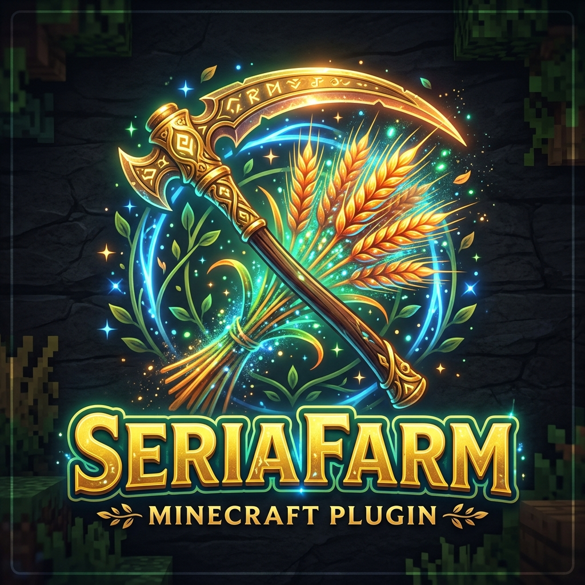

# SeriaFarm

## Overview
**SeriaFarm** is a comprehensive farming and block regeneration system designed for high-end RPG servers. It features hybrid mechanics that combine traditional farming with advanced custom plant growth, regional protections, and skill integrations.

## Features
- **Block Regeneration System**: Automatically restores harvested blocks (crops, ores, etc.) after a configurable delay.
- **Custom Plant System**: Create unique crops with multiple growth stages, custom models (ItemsAdder/Oraxen/Nexo), and specific soil/water requirements.
- **Regional Control**: Define specific behaviors for WorldGuard regions or global settings.
- **AuraSkills Integration**: Farming efficiency and rewards scale with player skill levels.
- **Requirement Engine**: Restrict harvesting based on tools (MMOItems), skill levels, or permissions.
- **Dynamic GUIs**: Manage all crops, regions, and settings through an intuitive in-game menu system.

## Commands
- `/sfarm`: Main command for administrative configuration and GUI access.
- `/sfarm menu`: Open the farm management dashboard.

## Developer Wiki
For detailed configuration guides, region setup, and custom plant creation, visit the [Wiki](docs/WIKI.md).
